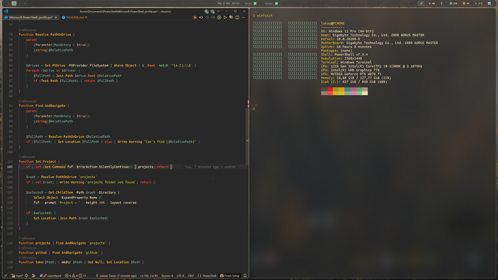

# 🏠 Dotfiles

> My personal development environment configuration managed with [chezmoi](https://www.chezmoi.io/)

[](https://www.chezmoi.io/)
[](https://github.com/PowerShell/PowerShell)
[](https://neovim.io/)
[](https://www.microsoft.com/windows)
[](https://www.linux.org/)



## ✨ Features

This dotfiles repository provides a complete, reproducible development environment for Windows and Linux systems, featuring:

- 🪟 **Windows Package Management** - Automated installation via winget
- 🎨 **Custom Window Manager** - GlazeWM tiling window manager with Zebar status bar
- 💻 **PowerShell Configuration** - Enhanced prompt with Starship, PSReadLine customizations, and productivity aliases
- 🔧 **Development Tools** - Neovim (LazyVim), VS Code, Git, and language-specific setups
- 🖋️ **Nerd Fonts** - Ubuntu Mono Nerd Font patched for powerline and icons
- 🔵 **Azure Integration** - Custom Azure status proxy with system tray integration
- 📜 **Utility Scripts** - PowerShell automation scripts for common tasks

## 🚀 Quick Install

### Windows

Run in PowerShell:
```powershell
irm https://raw.githubusercontent.com/lukaszgasior/dotfiles/main/install.ps1 | iex
```

### Linux (Ubuntu)

Run in bash:
```bash
curl -fsSL https://raw.githubusercontent.com/lukaszgasior/dotfiles/main/install.sh | bash
```

The installation script will:
1. ✅ Install Git (if not present)
2. ✅ Install chezmoi (if not present)
3. ✅ Initialize and apply dotfiles configuration

## 📦 What's Included

### Configuration Files

- **PowerShell Profile** ([Microsoft.PowerShell_profile.ps1](home/Documents/PowerShell/Microsoft.PowerShell_profile.ps1))
  - Starship prompt integration
  - PSReadLine with history search and custom keybindings
  - Gruvbox color scheme
  - kubectl completion and aliases
  - Neovim as default editor
  - Useful functions: `projects`, `github`, `take`, `which`, `Get-PublicIP`

- **Starship Prompt** ([starship.toml](home/dot_config/starship.toml))
  - Custom Gruvbox Dark theme
  - Git status indicators
  - Azure subscription display
  - Language version indicators (Go, Node.js, Python, .NET, Terraform)
  - Docker context awareness

- **Window Manager** ([GlazeWM config](home/dot_glzr/glazewm/config.yaml))
  - Tiling window manager for Windows
  - Custom Zebar widget with Azure status integration

- **Neovim** ([LazyVim config](home/dot_config/nvim/))
  - Full LazyVim distribution with custom plugins
  - LSP, Treesitter, Telescope, Lualine configurations

- **VS Code** ([settings.json](home/AppData/Roaming/Code/User/settings.json), [keybindings.json](home/AppData/Roaming/Code/User/keybindings.json))
  - Editor preferences and custom keybindings

- **Windows Terminal** ([settings.json](home/AppData/Local/Packages/Microsoft.WindowsTerminal_8wekyb3d8bbwe/LocalState/settings.json))
  - Custom profiles and theme

- **Git** ([.gitconfig](home/dot_gitconfig.tmpl))
  - User configuration template

### Utilities

#### PowerShell Scripts ([scripts/](scripts/))

- **[CleanupPodman.ps1](scripts/CleanupPodman.ps1)** - Clean up Podman containers and images
- **[CompresVideo.ps1](scripts/CompresVideo.ps1)** - Video compression utility
- **[ConvertoToMp4.ps1](scripts/ConvertoToMp4.ps1)** - Convert videos to MP4 format
- **[ConvertoToMp3.ps1](scripts/ConvertoToMp3.ps1)** - Convert audio/video to MP3
- **[Convert-to-ssh.ps1](scripts/Convert-to-ssh.ps1)** - Convert Git remotes to SSH
- **[Get-DuplicateModule.ps1](scripts/Get-DuplicateModule.ps1)** - Find duplicate PowerShell modules
- **[Uninstall-DuplicateModule.ps1](scripts/Uninstall-DuplicateModule.ps1)** - Remove duplicate modules
- **[Uninstall-AzModule.ps1](scripts/Uninstall-AzModule.ps1)** - Uninstall Azure PowerShell modules
- **[Update-EveryModule.ps1](scripts/Update-EveryModule.ps1)** - Update all PowerShell modules

#### Azure Status Proxy ([azure-status-proxy/](azure-status-proxy/))

A Go-based system tray application that:
- Provides local CORS proxy for Azure Status RSS feed
- Displays Azure status in system tray
- Quick access to Azure Status page
- Integrates with Zebar widget for real-time status display

### Fonts

- **Ubuntu Mono Nerd Font** - Patched font with additional glyphs for powerline and icon support

## 🛠️ Manual Setup

If you prefer manual installation:

1. Install chezmoi:
   ```bash
   # Windows
   winget install twpayne.chezmoi

   # Linux
   sh -c "$(curl -fsLS get.chezmoi.io)"
   ```

2. Initialize dotfiles:
   ```bash
   chezmoi init lukaszgasior/dotfiles
   ```

3. Review changes:
   ```bash
   chezmoi diff
   ```

4. Apply configuration:
   ```bash
   chezmoi apply
   ```

## 🔄 Updating

To update your dotfiles to the latest version:

```bash
chezmoi update
```

Or manually:
```bash
chezmoi git pull && chezmoi apply
```

## 🤝 Contributing

Feel free to fork this repository and customize it for your own needs. If you find bugs or have suggestions, please open an issue.

## 📄 License

This configuration is provided as-is for personal use. Individual tools and applications are subject to their respective licenses.

## 🔗 Resources

- [chezmoi Documentation](https://www.chezmoi.io/)
- [Starship Prompt](https://starship.rs/)
- [GlazeWM](https://github.com/glzr-io/glazewm)
- [LazyVim](https://www.lazyvim.org/)
- [Nerd Fonts](https://www.nerdfonts.com/)

---

**Note**: This is a personal dotfiles repository. Review and test configurations before applying to your system.
