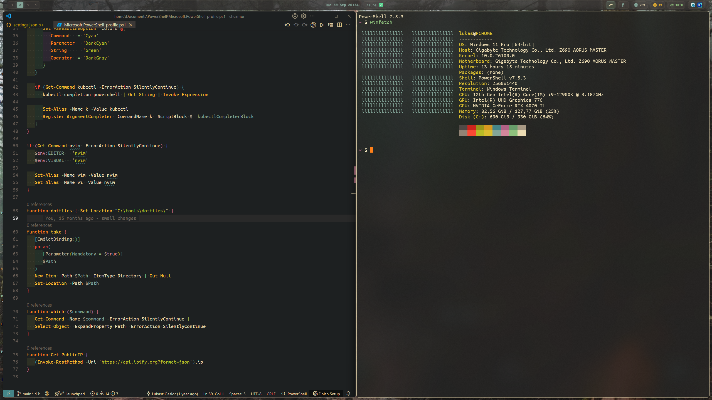

# Dotfiles

My personal dotfiles managed with [chezmoi](https://www.chezmoi.io/).



## Quick Install

On Windows, run in PowerShell:
```powershell
irm https://raw.githubusercontent.com/lukaszgasior/dotfiles/main/install.ps1 | iex
```

On Linux(ubuntu), run in bash:
```powershell
curl -fsSL https://raw.githubusercontent.com/lukaszgasior/dotfiles/main/install.sh | bash
```

This will:
1. Install Git if not present
2. Install chezmoi if not present
3. Initialize and apply dotfiles configuration

## What's Inside

- Windows package installation via winget (packages listed in `.chezmoidata/winget-export.json`)
- install fonts
- PowerShell
- Git
- vscode plugins and configuration
- windows terminal
- starship prompt
- GlazeWM and Zebar
- Windows 11 debloat script
